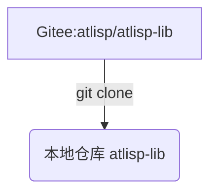
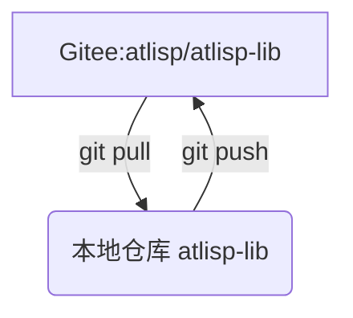
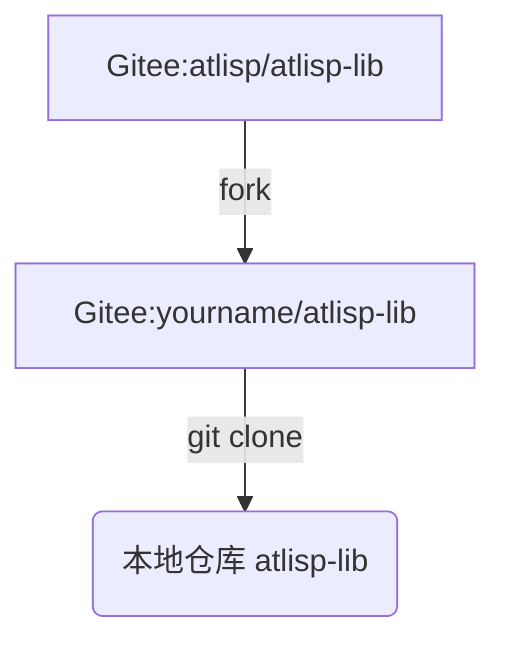
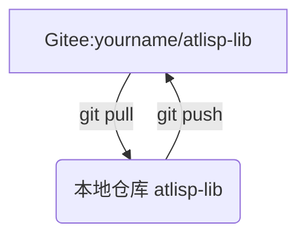
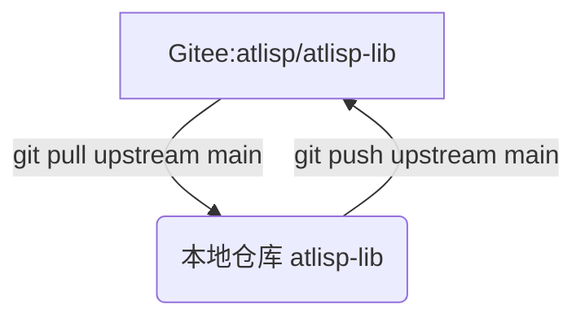

# @lisp 函数库开发教程

### 必备工具
#### git 源码管理工具

请先阅读： [git-使用说明.org](https://gitee.com/atlisp/atlisp-lib/blob/main/git-%E4%BD%BF%E7%94%A8%E8%AF%B4%E6%98%8E.org) 

Git（读音为/gɪt/）是一个开源的分布式版本控制系统，可以有效、高速地处理从很小到非常大的项目版本管理。
链接：https://pan.baidu.com/s/1rpfm3pLYIU3wS1V4gXLN0w?pwd=zgl5
提取码：zgl5

### 使用 git 交付代码为@lisp提供贡献 (无 fork)
#### 首先 clone
```lisp
git clone git@gitee.com:atlisp/atlisp-lib.git
```

#### 持续交付  pull 开发 push
```lisp
cd atlisp-lib
git pull 
# 修改
git add .
git commit -m "message"
git push
```


### 使用 git 交付代码为@lisp提供贡献 (fork)
#### fork me
在 https://gitee.com/atlisp/atlisp-lib 右上角 fork .

#### 首先 clone
```lisp
git clone git@gitee.com:yourname/atlisp-lib.git
cd atlisp-lib
git remote add upstream http://gitee.com/atlisp/atlisp-lib.git
```

#### 持续交付  pull 开发 push 
本过程为交付到你的 Gitee 远程仓库 yourname/atlisp-lib
```lisp
cd atlisp-lib
git pull 
# 修改
git add .
git commit -m "message"
git push
```


#### 持续交付 Pull Requests
本过程为交付 (Pull Requests) 到 @lisp 上游仓库 atlisp/atlisp-lib
```lisp
cd atlisp-lib
git pull upstream main
# 修改
git push upstream main
```




### 开发规范说明

本函数库建议一个函数定义为一个.lsp文件,函数代码均在 src 目录下。

src 目录下的文件夹为函数类名。 如 block , entity , string 等。

子目录下为函数名.

如 block 目录下的 insert.lsp ， entity 目录下的 getdxf.lsp 

代码文件内的函数名应为 类名:函数名 

按以下格式书写代码，可以自动生成函数文档。

```lisp
(defun block:insert (para)
  "函数功能说明"
  "函数返回值类型"
  "示例"
  ;; 以下为函数主体代码
  ...
)
(defun entity:getdxf (para ...）
  "函数功能说明"
  "函数返回值类型"
  "示例"
  ;; 以下为函数主体代码
  ...
)
```

### 测试 （开发中)

在代码提交的函数将自动同步到 atlisp.cn 的函数库 release 版本库。 

测试人员在CAD环境中加载 release 版本的函数定义。

测试通过后 在CAD 环境中上传到 stable 版本。

stable 版本为最终用户使用的函数库

### 参与贡献
欢迎您加入 @lisp 开发者行列。请您按以下步骤将您的函数添加到 @lisp函数库

1.  首先Fork 本仓库
2.  新建 你的分支
3.  添加您的函数，可以在原来的分类文件夹中添加，也可以添加您自己的分类名。
4.  提交代码
5.  新建 Pull Request
6.  等待 @lisp 函数库的管理员 Merge(合并) 后，广大用户就可以使用您共享的函数了。

### More:
函数库详细内容请至
  
https://atlisp.cn/doc/function-lib.html

@lisp应用云  https://atlisp.cn
